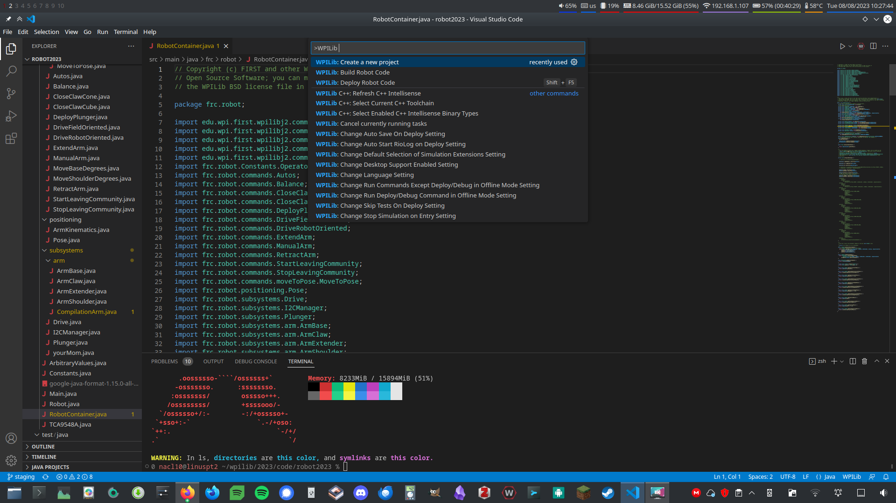
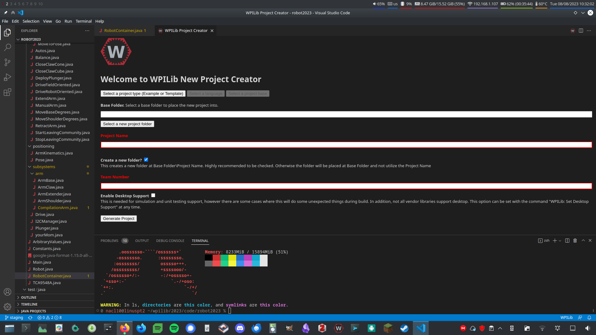
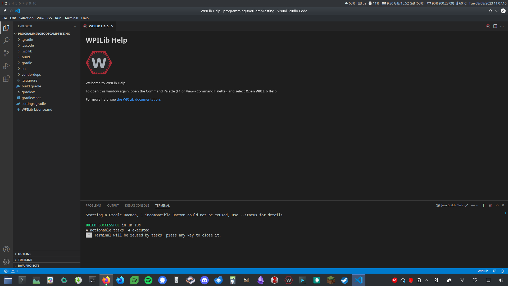

# Robotics Programming Basics

This page is a simultaneous overview of both some basic concepts of programming in robotics, and how we implement those concepts in FRC programming. We'll explain this by having you go through the steps of building a basic working robot program.

## Step 1: Setting Up the Environment

Open WPILib VS Code. If you're not on a computer that already has it installed, installation instructions can be found [here](https://docs.wpilib.org/en/stable/docs/zero-to-robot/step-2/wpilib-setup.html).&#x20;

WPILib VS Code is a special version of the popular code editor Visual Studio Code that has been converted into an IDE (or Integrated Development Environment) for programming FRC robots with WPILib. An IDE is an application that includes all the tools that you need for development in a particular language or, in our case, a particular library.&#x20;

Next, we'll create a new project. Start by opening the command palette by clicking on the red hexagon with the black circle and white letter W in the top right-hand corner.

<figure><figcaption></figcaption></figure>

Now type "new" and select "WPILib: Create a new project." You'll then be greeted by this screen:

<figure><figcaption></figcaption></figure>

Next, click on "Select a project type." We'll use a Template. Select java as the project language, and Timed Robot as the project base.

For the base folder, we recommend creating a directory within the WPILib directory. On Windows, that makes the base folder `C:\Users\Public\wpilib\(current year)\code`, and `~/wpilib/(current year)/code` on macOS and Linux. You'll want to replace the (current year) part with the year that it is right now.&#x20;

The project name can really be whatever you want, but keep in mind that it will be the name of the folder the project resides in and how you identify it, so keep it descriptive.

You'll enter our team number in the team number box, which is 937.

Go ahead and click the checkbox for desktop support. You won't need it today, but it's generally a good idea to enable it for all robot projects, since it doesn't do any harm and you'll need it enabled for some advanced features down the road.

Click "Generate Project." It'll create the project, then ask if you'd like to open the new window. Click yes, and you should be greeted by a window that looks something like this:

<figure><figcaption></figcaption></figure>

Congrats! You've now created a development environment for programming FRC robots.

## Step 1.5: Understanding What We're About to Do

Now it's time to write actual robot code. But before we can do that, we need to understand some basics of how robot programs work.

Start by clicking the small arrow next to `src` in the sidebar on the left, then the small arrow next to `java`. Now double-click on Robot.java.

In this file, you'll find a bunch of methods with JavaDoc above them explaining what they do. When robot code is run, the robot will automatically create an instance of this class, and then start a loop which runs some methods every 20ms, or 0.02 seconds. Which methods it runs depends on which _mode_ the robot is in.&#x20;

### Modes

In FRC, robots have 5 _modes_: Disabled, Autonomous, Teleoperated, Test, and Simulation. At least for today, we won't use Test or Simulation—Test is for some debugging tools we don't use, and Simulation is for running a simulated robot, which we have neither the CAD models nor the computing horsepower to do properly. The other three are more important to us.

In Disabled mode, the robot is essentially supposed to do nothing. The roboRIO, which is essentially the robot "brain" in FRC, will basically cut off power to anything that moves (like motors or pneumatics) at the hardware level, and trying to make anything move with code in Disabled mode will yield errors.&#x20;

Autonomous mode is intended to run during the 15-second autonomous period at the beginning of a match, wherein the robot is _supposed_ to do stuff autonomously and the driver is not allowed to touch the robot controller.

Teleoperated is intended to run during the period of the match where the driver controls the robot, and is the mode that we use most often for testing, since it's pretty hard to test stuff if you can't control the robot.

### Periodic and Init Methods

As you've probably noticed, each mode has a couple of methods: one that says periodic, and one that says init. For example: `teleopInit()` and `teleopPeriodic()`. There are also a couple of other methods, `robotInit()` and `robotPeriodic()`. Each `Init` method will run once at the start of the mode it's for, and each `Periodic` method will run every 20ms while the robot is in that mode. `robotInit()`, on the other hand, will run once when the robot is first started up, and `robotPeriodic()` will run every 20ms no matter the mode.

In a timed robot paradigm, like the one we're using for this starter project, these methods are the primary places your robot's logic will go. So now, let's actually write that robot logic.

## Step 2: Let's Turn a Motor!

Now that we know what's going on conceptually, let's try it ourselves!

### Useful Info for Writing Your Program

You can create an instance of an Xbox controller (which are the controllers we use) with `private final XboxController controller = new XboxController(0);`. The `0` parameter is the port number that the controller is plugged into, in our case `0` is fine.

You can create a motor controller (which does what it sounds like, it controls a motor) with `private final Talon motor = new Talon(0)`. In the future, you might use a different kind of motor controller (like a `Spark` or even a fancy one like a `SparkMAX`), but for today we're using a `Talon`.  You also might want to use a different number than `0` for the parameter based off of which motor controller you're interfacing with, but for today `0` is fine.

You can find out whether the "A" button is pressed by calling `controller.getAButton()`. This will return a `boolean`, which will be `true` if the button is pressed and `false` if it is not.

You can set the speed of a motor by calling `motor.set(speed)`. Replace `speed` with a number between `-1.0` and `1.0` representing how fast you want the motor to spin. `-1.0` will spin it at 100% power in the reverse direction, and `1.0` will spin it at 100% power in the forward direction. `0` will stop the motor.

### Your Task

Write a robot program in `Robot.java` that turns a motor at 50% power when you're pressing the A button on the controller, and stops it when you let go of the button.


**Hint:** You'll want to use an`if` statement to check if the button is being pressed.


**Please try to do it on your own **_**before**_** you look at the solution!**

## Solution

```java
// Copyright (c) FIRST and other WPILib contributors.
// Open Source Software; you can modify and/or share it under the terms of
// the WPILib BSD license file in the root directory of this project.

package frc.robot;

import edu.wpi.first.wpilibj.TimedRobot;
import edu.wpi.first.wpilibj.XboxController;
import edu.wpi.first.wpilibj.motorcontrol.Talon;

public class Robot extends TimedRobot {

  /* Create the controller and motor */
  /* I've deleted all the comments except my own for readability */
  private final XboxController controller = new XboxController(0);
  private final Talon motor = new Talon(0);

  @Override
  public void robotInit() {}

  @Override
  public void robotPeriodic() {}

  @Override
  public void autonomousInit() {}

  @Override
  public void autonomousPeriodic() {}

  @Override
  public void teleopInit() {}

  @Override
  public void teleopPeriodic() {
    if (controller.getAButton()) { // If the A button is pressed...
      motor.set(0.5); // ...then run the motor at 50% power
    } else { // If it's not pressed...
      motor.set(0); // ...then stop the motor (prevents the motor from
                    // running forever)
    }
  }

  @Override
  public void disabledInit() {}

  @Override
  public void disabledPeriodic() {}

  @Override
  public void testInit() {}

  @Override
  public void testPeriodic() {}

  @Override
  public void simulationInit() {}

  @Override
  public void simulationPeriodic() {}
}
```
